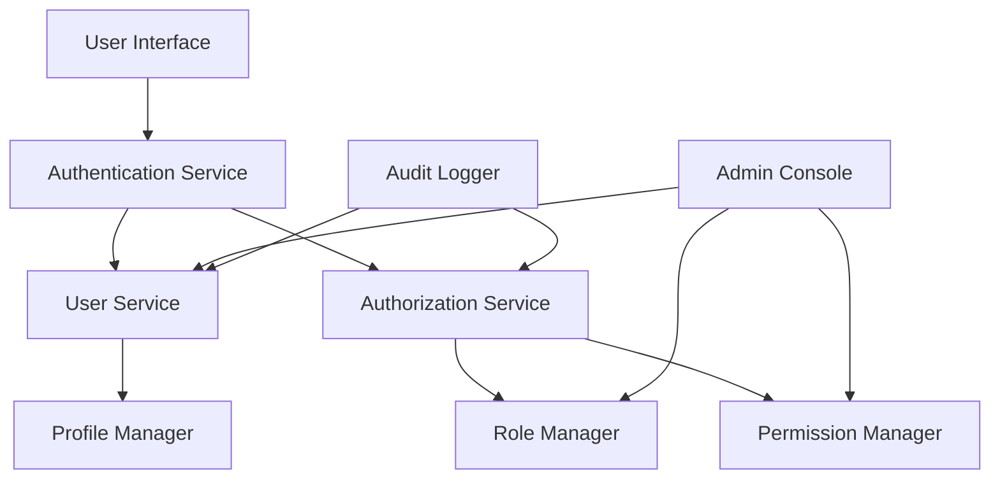

# Component Diagram

## System Components

## Component Descriptions
### Authentication Service
Handles user authentication, login/logout, and password management

### User Service
Manages user accounts and profile information

### Authorization Service
Manages roles and permissions

### Profile Manager
Handles user profile updates and management

### Role Manager
Manages role definitions and assignments

### Permission Manager
Handles permission definitions and role assignments

### Admin Console
Administrative interface for user and role management

### Audit Logger
Tracks system activities and changes