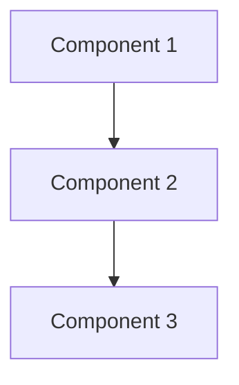

# Component Diagram

## System Components

```mermaid
graph TD
    A[Component 1] --> B[Component 2]
    B --> C[Component 3]
```

## Component Descriptions
### Component 1
Description of Component 1...