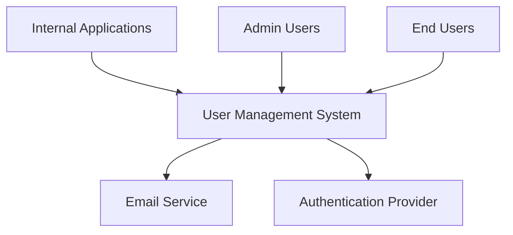

# System Context

## Overview
The User Management System provides centralized user authentication, authorization, and account management capabilities. It integrates with external authentication providers and internal systems requiring user access control.

## Context Diagram

## System Interfaces
1. Email Service Interface
   - Handles password reset notifications
   - Account verification emails
   
2. Authentication Provider Interface
   - OAuth/OIDC integration
   - SSO capabilities

3. Internal Application Interface
   - Role-based access control
   - User verification endpoints