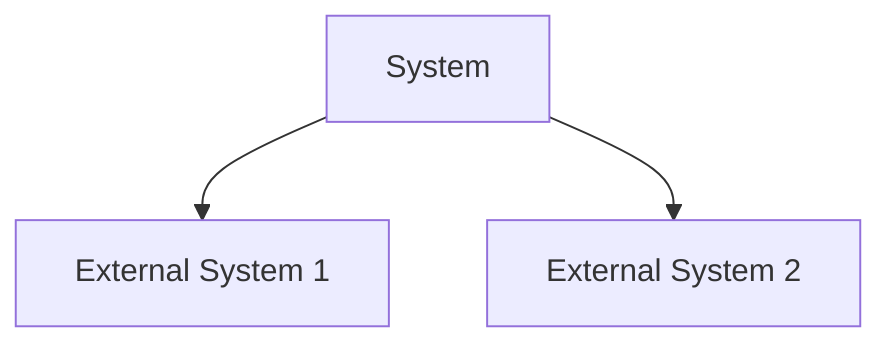

# System Context

## Overview
High-level description of how the system fits into the larger environment.

## Context Diagram

## System Interfaces
Description of major system interfaces and interactions.