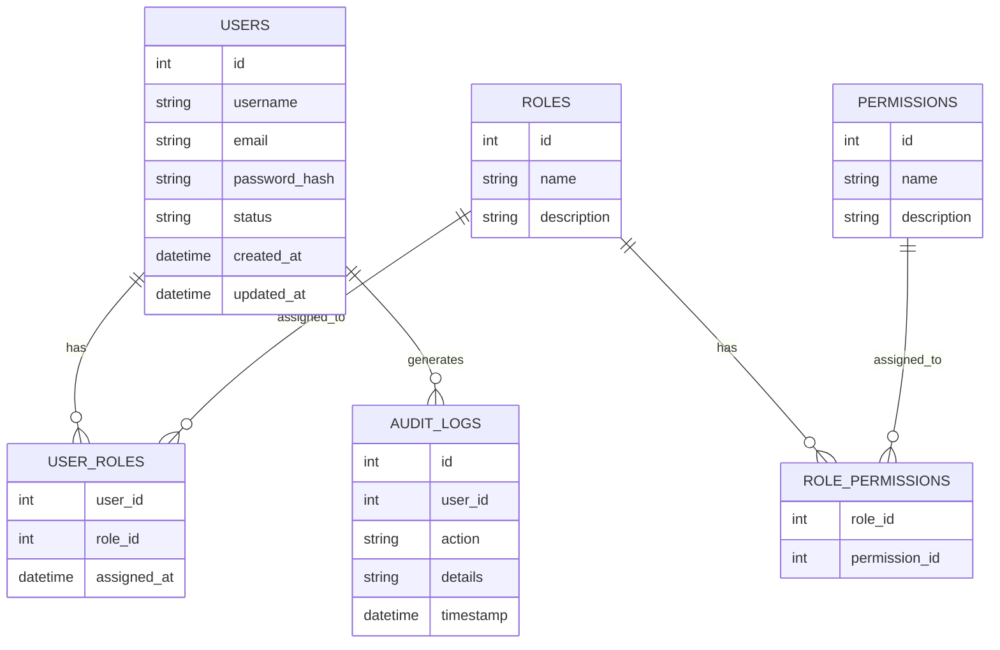

# Entity Relationship Diagram

```mermaid
erDiagram
    USERS ||--o{ USER_ROLES : has
    ROLES ||--o{ USER_ROLES : assigned_to
    ROLES ||--o{ ROLE_PERMISSIONS : has
    PERMISSIONS ||--o{ ROLE_PERMISSIONS : assigned_to
    USERS ||--o{ AUDIT_LOGS : generates
    
    USERS {
        int id
        string username
        string email
        string password_hash
        string status
        datetime created_at
        datetime updated_at
    }
    ROLES {
        int id
        string name
        string description
    }
    PERMISSIONS {
        int id
        string name
        string description
    }
    USER_ROLES {
        int user_id
        int role_id
        datetime assigned_at
    }
    ROLE_PERMISSIONS {
        int role_id
        int permission_id
    }
    AUDIT_LOGS {
        int id
        int user_id
        string action
        string details
        datetime timestamp
    }
```

## Entity Descriptions
Description of each entity and their relationships...
